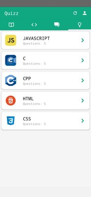
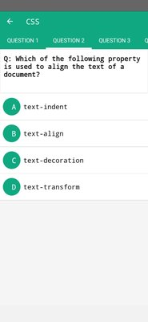

# CodeEssentials

## A Resource Library

## CodeEssentials is a mobile app where you can
+ Test your Skills through quizzes.
+ Take up courses to inhance your learing.
+ Post questions/discuss about stuff amoung the community(UI under development).
+ Get Daily Puzzles and Coding Problems.

## Technologies Used
+ Nodejs - Backend
+ ReactNative - Frontend
+ MongoDB - Database

ScreenShots:

